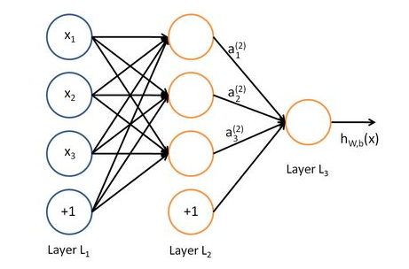

# 反向传播为什么要反向
1958年单层神经网络出现的使得神经网络火了一把，但是人们发现连异或这样的简单分类都不能解决，于是直到20年后1986年BP反向传播算法的出现才使神经网络彻底再次火起来。

其实两层神经网络不仅可以解决异或问题，而且具有非常好的非线性分类效果。不过两层神经网络的计算是一个问题，没有一个较好的解法。1986年，Rumelhar和Hinton等人提出了反向传播（Backpropagation，BP）算法，解决了两层神经网络所需要的复杂计算量问题，

## 理解反向传播怎么解决复杂计算

机器学习可以看做是数理统计的一个应用，在数理统计中一个常见的任务就是拟合，也就是给定一些样本点，用合适的曲线揭示这些样本点随着自变量的变化关系。

深度学习同样也是为了这个目的，只不过此时，样本点不再限定为(x, y)点对，而可以是由向量、矩阵等等组成的广义点对(X,Y)。而此时，(X,Y)之间的关系也变得十分复杂，不太可能用一个简单函数表示。然而，人们发现可以用多层神经网络来表示这样的关系，而多层神经网络的本质就是一个多层复合的函数。

上面式中的Wij就是相邻两层神经元之间的权值，它们就是深度学习需要学习的参数，也就相当于直线拟合y=k*x+b中的待求参数k和b。

深度学习的训练也有一个目标函数，这个目标函数定义了什么样的参数才算一组“好参数”，不过在机器学习中，一般是采用成本函数（cost function），然后，训练目标就是通过调整每一个权值Wij来使得cost达到最小。cost函数是由所有待求权值Wij为自变量的复合函数，而且基本上是非凸的，即含有许多局部最小值。但实际中发现，采用我们常用的梯度下降法就可以有效的求解最小化cost函数的问题。

损失函数，代价函数，目标函数

给定x，使用三个函数f(X)拟合样本x特征，输出f(X)与真实值Y，为了表示拟合的好坏，用一个函数来度量拟合的程度。这个函数就称为损失函数(loss function)，或者叫代价函数，成本函数(cost function)。

损失函数：计算的是一个样本的误差

代价函数：是整个训练集上所有样本误差的平均，（风险函数，成本函数都是该部分的叫法）

目标函数：代价函数 + 正则化项

在机器学习中,很多算法最后都会转化为求一个目标损失函数（loss function）的最小值。这个损失函数往往很复杂，难以求出最值的解析表达式。而梯度下降法正是为了解决这类问题。

梯度下降法需要给定一个初始点，并求出该点的梯度向量，然后以负梯度方向为搜索方向，以一定的步长进行搜索，从而确定下一个迭代点，再计算该新的梯度方向，如此重复直到cost收敛。那么如何计算梯度呢？

### 示例

求e=(a+b)*(b+1)的偏导

链式法则可得

e对a的偏导是从a到e的路径上的偏导值的乘积。e对b的偏导是从b到e的路径1(b-c-e)上的偏导值的乘积加上路径2(b-d-e)上的偏导值的乘积。

注意：**路径被重复访问**了，比如图中，a-c-e和b-c-e就都走了路径c-e。对于权值动则数万的深度模型中的神经网络，这样的冗余所导致的计算量是相当大的。

### BP的做法

同样是利用链式法则，BP算法则机智地避开了这种冗余，它对于每一个路径只访问一次就能求顶点对所有下层节点的偏导值。

BP算法是反向(自上往下)来寻找路径的。

从最上层的节点e开始，初始值为1，以层为单位进行处理。对于e的下一层的所有子节点，将1乘以e到某个节点路径上的偏导值，并将结果“堆放”在该子节点中。等e所在的层按照这样传播完毕后，第二层的每一个节点都“堆放"些值，然后我们针对每个节点，把它里面所有“堆放”的值求和，就得到了顶点e对该节点的偏导。

节点c接受e发送的1*2并堆放起来，节点d接受e发送的1*3并堆放起来，至此第二层完毕，求出各节点总堆放量并继续向下一层发送。节点c向a发送2*1并对堆放起来，节点c向b发送2*1并堆放起来，节点d向b发送3*1并堆放起来，至此第三层完毕，节点a堆放起来的量为2，节点b堆放起来的量为2*1+3*1=5, 即顶点e对b的偏导数为5.

# 动态规划理解反向传播

# 反向传播原理

[BP论文](<http://www.iro.umontreal.ca/~pift6266/A06/refs/backprop_old.pdf>)

# 实现反向传播
