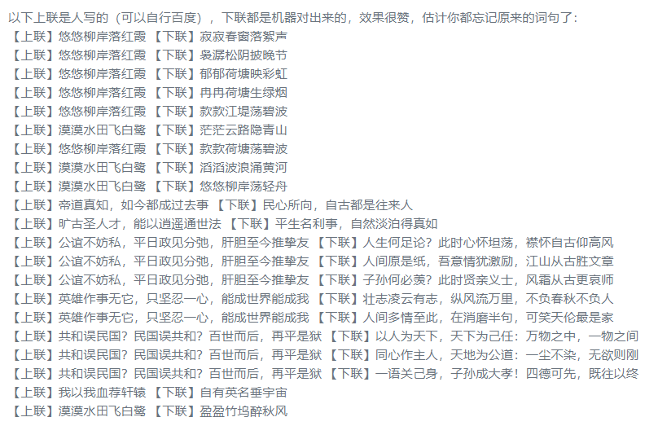
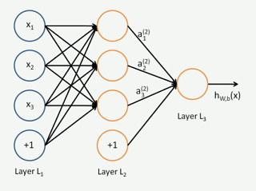

# 前言

很多人都可以Github上找到高级的AI代码；自己找到数据训练。例如：自动写诗

周星驰的电影里如果对穿肠有这样的机器，啧啧

上述图片来自[GPT2-Chinese](<https://github.com/Morizeyao/GPT2-Chinese>)；最近很火的[GPT3](<https://github.com/openai/gpt-3>)又出来的；据说很强大。

如果你不需要读懂源码，不需要更改算法模型，拿下来找到数据，训练自己的模型还是可以的。如果想要了解原理，并进行优化；则需要学习深度学习。
学习深度学习的第一步是要知道什么是神经元。

# 什么是深度学习
深度学习是一种实现机器学习的技术，机器学习是一种实现人工智能的方法。

人工智能很多企业都在谈及并投入生产研究，这就导致了近几年什么专业的高材生都在扎堆这个领域。
机器学习，是使用算法来解析数据、从中学习，然后对真实世界中的事件做出决策和预测。与传统的为解决特定任务、硬编码的软件程序不同，机器学习是用大量的数据来“训练”，通过各种算法从数据中学习如何完成任务。
深度学习：深度：包含多个隐含层的神经网络结构（就是深，即网络层数很多）；学习：实现机器学习的技术（前面看机器学习时干啥的）。

# 什么是神经网络

x1,x2,x3 是输入层；第二层 是隐藏层
神经网络：就是N个上图的小圆圈组成的有输入中间层输出的网络

# 开始神经神经元

