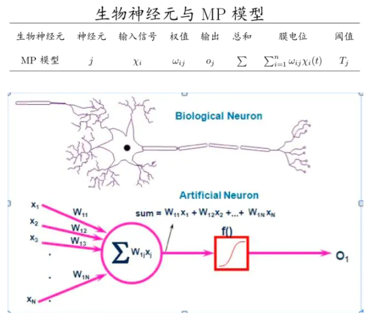
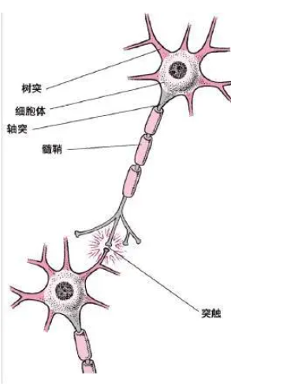

# 前言

很多人都可以Github上找到高级的AI代码；自己找到数据训练。例如：自动写诗

周星驰的电影里如果对穿肠有这样的机器，啧啧

上述图片来自[GPT2-Chinese](<https://github.com/Morizeyao/GPT2-Chinese>)；最近很火的[GPT3](<https://github.com/openai/gpt-3>)又出来的；据说很强大。

如果你不需要读懂源码，不需要更改算法模型，拿下来找到数据，训练自己的模型还是可以的。如果想要了解原理，并进行优化；则需要学习深度学习。学习深度学习的第一步是要知道什么是神经元。

# 什么是深度学习

`深度学习是一种实现机器学习的技术，机器学习是一种实现人工智能的方法。`

人工智能很多企业都在谈及并投入生产研究，这就导致了近几年什么专业的高材生都在扎堆这个领域。

机器学习，是使用算法来解析数据、从中学习，然后对真实世界中的事件做出决策和预测。与传统的为解决特定任务、硬编码的软件程序不同，机器学习是用大量的数据来“训练”，通过各种算法从数据中学习如何完成任务。

深度学习：深度：包含多个隐含层的神经网络结构（就是深，即网络层数很多）；学习：实现机器学习的技术（前面看机器学习时干啥的）。

# 什么是神经网络

x1,x2,x3 是输入层；第二层 是隐藏层；第三层是输出层

神经网络：就是N个上图的小圆圈组成的有输入中间层输出的网络

# 开启神经元

## MP模型诞生

1943年，基于生物神经网络莫克罗-彼特氏神经模型（McCulloch－Pitts′neuronmodel）诞生。它由心理学家Warren McCulloch和数学家Walter Pitts合作提出。

**神经元模型是一个包含输入，输出与计算功能的模型。**

输入可以类比为神经元的树突，而输出可以类比为神经元的轴突，计算则可以类比为细胞核。类比看一下生物的神经元如下：

McCulloch-Pitts模型公式:

抽象出神经元模型

z是在输入a和权值w的线性加权sum和叠加了一个函数g的值。在MP模型里，函数g是sgn函数，也就是取符号函数。这个函数当输入大于0时，输出1，否则输出0。

简单的MP模型，建立了神经网络大厦的地基。但是，MP模型中，权重的值都是预先设置的，因此不能学习。

1949年心理学家Hebb提出了Hebb学习率，认为人脑神经细胞的突触（也就是连接）上的强度上可以变化的。于是计算科学家们开始考虑用调整权值的方法来让机器学习。这为后面的学习算法奠定了基础。

## 单层神经网络-感知器

1958年，计算科学家Rosenblatt提出了由两层神经元组成的神经网络。他给它起了一个名字--“**感知器**”（Perceptron）

与神经元模型不同，感知器中的权值是通过训练得到的。因此，根据以前的知识我们知道，感知器类似一个逻辑回归模型，可以做线性分类任务。

### 代码

[代码](<https://github.com/pergrand/NLP-Interview/blob/master/5-%E6%B7%B1%E5%BA%A6%E5%AD%A6%E4%B9%A0/MP.py>)

感知器只能做简单的线性分类任务。Minsky在1969年出版了一本叫《Perceptron》的书，里面用详细的数学证明了感知器的弱点，尤其是感知器对XOR（异或）这样的简单分类任务都无法解决。

例如：代码中输入和真实值改为下面，无法进行分类

\# x = [[0,0],[0,1],[1,0],[1,1]]

\# y = [0,1,1,0]

## 两层神经网络（多层感知器）

Minsky说过单层神经网络无法解决异或问题。但是当增加一个计算层以后，两层神经网络不仅可以解决异或问题，而且具有非常好的非线性分类效果。不过两层神经网络的计算是一个问题，没有一个较好的解法。

1986年，Rumelhar和Hinton等人提出了**反向传播**（Backpropagation，**BP**）算法，解决了两层神经网络所需要的复杂计算量问题，从而带动了业界使用两层神经网络研究的热潮。目前，大量的教授神经网络的教材，都是重点介绍两层（带一个隐藏层）神经网络的内容。

在两层神经网络中，我们不再使用sgn函数作为函数g，而是使用平滑函数**sigmoid**作为函数g。我们把函数g也称作**激活函数**（active function）

神经网络的本质就是通过参数与激活函数来拟合**特征与目标**之间的真实函数关系。与单层神经网络不同。理论证明，两层神经网络可以无限逼近任意连续函数。也就是说，面对复杂的非线性分类任务，两层（带一个隐藏层）神经网络可以分类的很好。

### 训练

#### 激活函数

激活函数是用来加入**非线性因素**的，提高神经网络对模型的表达能力，解决线性模型所不能解决的问题。

#### 损失
机器学习模型训练的目的，就是使得参数尽可能的与真实的模型逼近。具体做法是这样的。首先给所有参数赋上随机值。我们使用这些随机生成的参数值，来预测训练数据中的样本。样本的预测目标为yp，真实目标为y。

那么，定义一个值loss，计算公式如下。

loss = (yp - y)2  　

这个值称之为**损失**（loss），我们的目标就是使对所有训练数据的损失和尽可能的小。可以把损失写为关于参数（parameter）的函数，这个函数称之为**损失函数**（loss function）。下面的问题就是求：如何优化参数，能够让**损失函数的值最小**。

#### 优化-梯度下降

问题如何让损失最小：

此时这个问题就被转化为一个优化问题。一个常用方法就是高等数学中的求导，但是这里的问题由于参数不止一个，求导后计算导数等于0的运算量很大，所以一般来说解决这个优化问题使用的是梯度下降算法。

梯度下降算法每次计算参数在当前的梯度，然后让参数向着梯度的反方向前进一段距离，不断重复，直到梯度接近零时截止。一般这个时候，所有的参数恰好达到使损失函数达到一个最低值的状态。

在神经网络模型中，由于结构复杂，每次计算梯度的代价很大。因此还需要使用反向传播算法。

#### 反向传播

反向传播算法的启示是数学中的**链式法则**。利用神经网络的结构进行的计算。不一次计算所有参数的梯度，而是从后往前,一层层反向传播。

首先计算输出层的梯度，然后是第二个参数矩阵的梯度，接着是中间层的梯度，再然后是第一个参数矩阵的梯度，最后是输入层的梯度。计算结束以后，所要的两个参数矩阵的梯度就都有了。

#### 正则化

化问题只是训练中的一个部分。机器学习问题之所以称为学习问题，而不是优化问题，就是因为它不仅要求数据在训练集上求得一个较小的误差，在测试集上也要表现好。

因为模型最终是要部署到没有见过训练数据的真实场景。提升模型在测试集上的预测效果的主题叫做**泛化**（generalization），相关方法被称作正则化（regularization）。神经网络中常用的泛化技术有**权重衰减**等。

#### 意义

两层神经网络在多个地方的应用说明了其效用与价值。10年前困扰神经网络界的异或问题被轻松解决。

但是神经网络仍然存在若干的问题：尽管使用了BP算法，一次神经网络的训练仍然耗时太久，而且困扰训练优化的一个问题就是局部最优解问题，这使得神经网络的优化较为困难。同时，隐藏层的节点数需要调参，这使得使用不太方便。

90年代中期，由Vapnik等人发明的SVM（Support Vector Machines，支持向量机）算法诞生，很快就在若干个方面体现出了对比神经网络的优势：无需调参；高效；全局最优解。基于以上种种理由，SVM迅速打败了神经网络算法成为主流。

## 多层神经网络（深度学习）

2006年，Hinton在《Science》和相关期刊上发表了论文，首次提出了“深度信念网络”的概念。与传统的训练方式不同，“深度信念网络”有一个“预训练”（pre-training）的过程，这可以方便的让神经网络中的权值找到一个接近最优解的值，之后再使用“微调”(fine-tuning)技术来对整个网络进行优化训练。

这两个技术的运用大幅度减少了训练多层神经网络的时间。他给多层神经网络相关的学习方法赋予了一个新名词--“深度学习”。

### 训练

与两层层神经网络不同。多层神经网络中的层数增加了很多。增加更多的层次有什么好处？更深入的表示特征，以及更强的函数模拟能力。

在单层神经网络时，我们使用的激活函数是sgn函数。到了两层神经网络时，我们使用的最多的是sigmoid函数。而到了多层神经网络时，通过一系列的研究发现，ReLU函数在训练多层神经网络时，更容易收敛，并且预测性能更好。

因此，目前在深度学习中，最流行的非线性函数是ReLU函数。ReLU函数不是传统的非线性函数，而是分段线性函数。其表达式非常简单，就是y=max(x,0)。简而言之，在x大于0，输出就是输入，而在x小于0时，输出就保持为0。这种函数的设计启发来自于生物神经元对于激励的线性响应，以及当低于某个阈值后就不再响应的模拟。

在深度学习中，泛化技术变的比以往更加的重要。这主要是因为神经网络的层数增加了，参数也增加了，表示能力大幅度增强，很容易出现过拟合现象。因此正则化技术就显得十分重要。目前，Dropout技术，以及数据扩容（Data-Augmentation）技术是目前使用的最多的正则化技术。

# 神经网络发展史

# 神经网络对比

# 神经网络类别

网络结构图看作是一个有向图。其中神经元代表顶点，连接代表有向边。对于前馈神经网络中，这个有向图是没有回路的。你可以仔细观察本文中出现的所有神经网络的结构图，确认一下。而对于反馈神经网络中，结构图的有向图是有回路的。反馈神经网络也是一类重要的神经网络。其中Hopfield网络就是反馈神经网络。深度学习中的RNN也属于一种反馈神经网络。

**参考：**
+ [神经网络通俗易懂](<https://blog.csdn.net/illikang/article/details/82019945>)
+ [神经网络入门](<https://zhuanlan.zhihu.com/p/65472471>)

